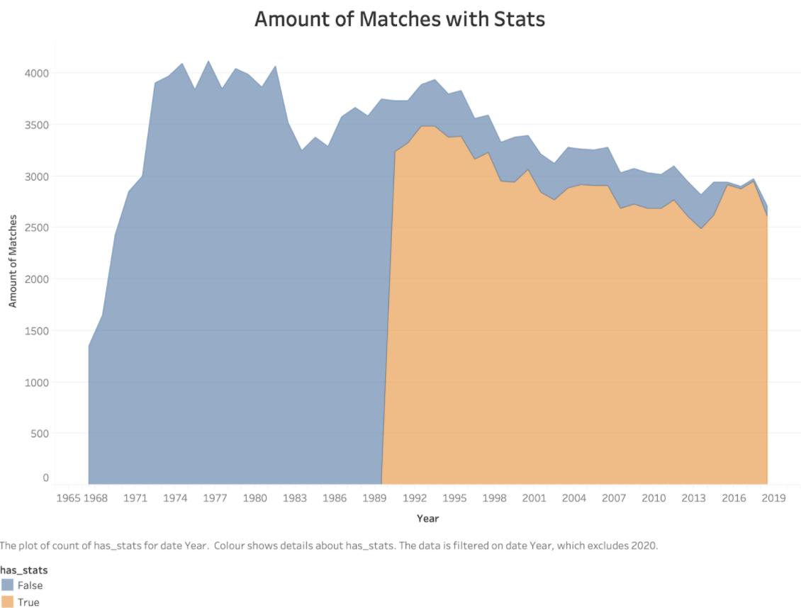
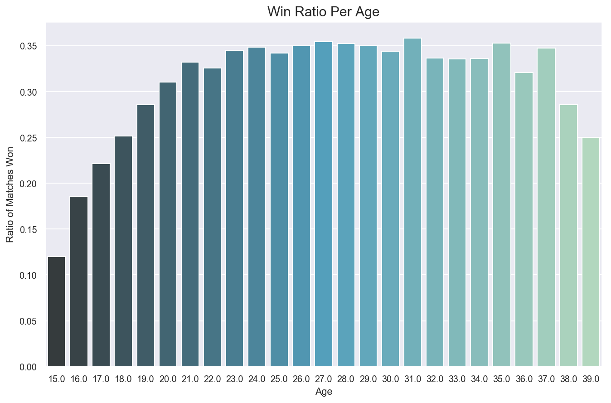
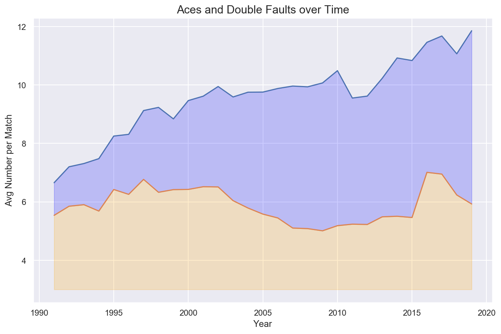
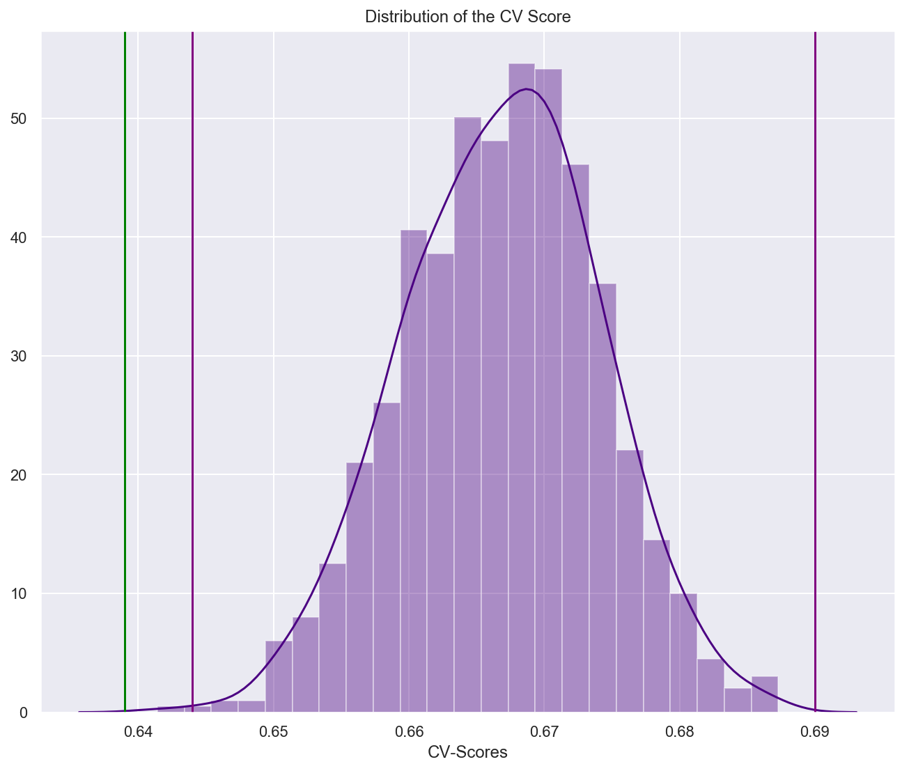
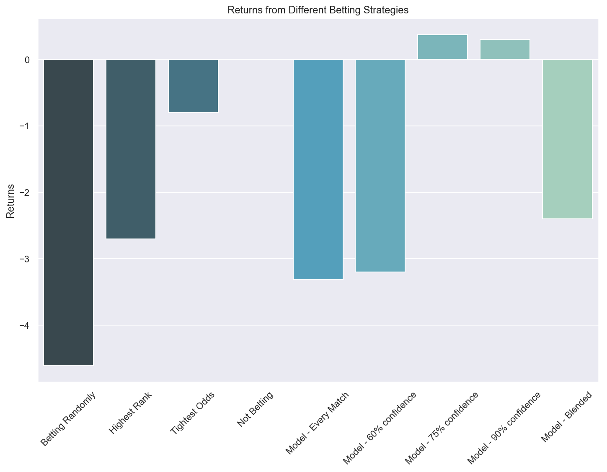

# Predicting Tennis - Modeling Outcomes with Machine Learning
### General Assembly Capstone Project

How accurately can you predict who will win a tennis match given past data? 
In this project I use data from 30 years of tennis and around 75,000 professional individual matches to predict who is the likely winner of any given tennis match. 

## Goals
My goals for this project were:
- Gather usable data for Tennis matches, players and bookmaker odds
- Clean and analyse the data, making sure that it is reliable and workable
- Feature Creation - use the data to create features which will feed and improve the model.
- Train Machine Learning models, evaluate predicitons and look at potential new features on the back of results. 
- Prediction Goal Primary Objective - Beat ranking baseline - create a model that will be able to predict the outcome of a tennis match better than just choosing the highest ranked player.
- Prediction Goal Secondary Objective - Beat the bookmakers predictions.

## The Data
For my project I will mainly be using data extracted from a docker container (https://github.com/mcekovic/tennis-crystal-ball/issues/337) - which was created opn the back of a large open source atp data repository from github = https://github.com/JeffSackmann/tennis_atp

I checked that this data was valid by cross referencing a number of stats between this database and the offcial ATP website, and everything I checked matched up. I will be using the last 30 years of data, as this is when the ATP started recording detailed match data, and so before this the information isnt as good. See below for visual representation of the usable matches. I only used data from 1991 as this is when the detailed data started.

In addition to this I have sourced some data files which include the betting odds for the last 20 years in order to check how my model measures up. I got this info from http://www.tennis-data.co.uk/alldata.php

Some issues I ran into in the data collection stage:
- Docker Dependencies - as the docker image was built to serve the ultimate tennis website, the sql database downloaded from the docker image had a number of dependencies which meant I had to manually review the raw sql file and remove all dependencies before I could load the database. 
- WTA Data incomplete - I was not able to get the same quality and range of data for women's tennis as men's tennis and so unfortunately for the time being I only focused on the data for men's tennis. I will adapt for another project in the future!
- Commonality Issues: There were no data fields in common which could link the betting odds data to exact matches and so I had to do some feature engineering to link the odds to any given match.  

## EDA
Before starting on the modeling some analysis and visualisation of the data to give an idea of what feature engineering would be useful. Have included a few examples of variables I looked at for example.

### Age
Age looked like it would be an important determinant as generally the win ratio peaks in the mid 20s. This led me to create some features around age and experience (amount of years since first professional match).

### Gamestyle over time
I wanted to see if the playstyle of winners changed over time - for instance below you can see that the number of aces have increased over time. I created a lot of features around strength of 1st and 2nd serve, strength of return and other play style statistics, and since I was not looking at time-series in this project I wanted to make sure that the model would generalise well to the whole time period (which based on the below chart isn't necesarrily the case).

### Networks (who is playing and beating who)
I wanted to create features around the amount of time each player has played each other in the past and also which players each player has played in common, which would help to give more accurate predictions for players who had never played before. I used networkx to map out which players were playing each other. In the below gif you can see ordered visual of which of the top tennis players played each other in 2019, with a new colour for each month. 

## Predictive Models and Evaluation
### Features used
- 4 player based features: Rank, ELO rating, Age, Height
- 32 previous season features: Surface wins and losses, serve, return and pressure points (tiebreaks) from the previous season
- 22 all time stats: Same as previous season, but with all data from before current match (some collinearity here as all time includes previous season - but I wanted to give additional weight to the previous season)
- 4 versus stats: Head to head features based on previous matches between the two players in the match predicted.

### Modelling issues
 - Missing data: Some features that I wanted I was not able to collect (e.g. serve speed, injuries, specific shot accuracy, play styles like serve and volley attempts).
 - Data Quality: Some of the features I was using had missing data
 	- Match stats: tried both inputing 0 and removing data for modelling (28.7%)
 	- Rank: inputed lowest possible rank (2%)
 	- Age: Removed missing age (0.3%)
 	- Height: inputed average (12.5%)
 - Model Reliability and Symmetry: This is where I spent a lot of the modelling time - making sure that the models were "reversible", see next section. 

### Modelling with Pairwise Features
One of the main challeges of this project was that I wanted the prediction of the model to be the same no matter which way you input the players (i.e. player1 v.s. player2 = player2 v.s. player1, all else equal). This presents a challenge since some models are not built to allow for this. Decision trees, for instance, are not symmetric, and the classification could be completely different depending who is in the player1 spot. In order to deal with this issue, I worked on a few different model types which could deal with this:
- Symmetric Model: All features are player1-player2, meaning that you will have the same feature no matter which player is put in first, just the sign will be flipped. I then use a logistic regression model with no y intercept so that the model is fully reversible. This is the model that worked the best in the end. 
- Pseudo-Symmetric Model: Features are not differences, but all observations are duplicated and flipped, and the weight of each datapoint is reduced to 50%. This means that the model trains on player1 being on the left and also on player2 being on the left hand side for the same match, meaning that the model will end up not creating lopsided models (e.g. weighted decision trees). This model is flawed in that it duplicates the data and therefore massively increases the training time, and was not perfectly symmetric. It did, however, allow me to run more models than just logistic regression.
- Non-Symmetric Model: Here I decided to create a model for one tennis player (Nadal) and see if that tennis player was likely to win any given match (which could then be expanded to train on any given tennis player). So here I used only matches in which Nadal played and Nadal was always on the right hand side. The issue here is that, even though Nadal is prolific, there were not enough observations for the model to find any improvements on baseline, and so this was the weakest approach. 

### Using AWS for gridsearch
Running the initial logistic regression with standard parameters for my symmetric model was ok to run on my laptop, but the parametrisation gridsearch promised to take over 2 days on my poor little dual core computer. So I decided to farm out the gridsearching to a more capabale AWS Machine Learning EC2 instance. See my blog at https://elasticvignette.wordpress.com/ for more details on this. 

### Machine Learning Class for Classification
During this project, I wanted to simplify the task of running the main classification models for any given dataset since I was constantly adding features and wanting to re-run all models to see how they fared. In order to help speed up this process I created a class which given a set of features and a target will run preprocessing steps (standardisation and train-test split) and then simply run a large selection of the scikit learn classification models. In addition to this I added time saving functions to run gridsearches, confusion matrices and ROC curves. The code is in this project, but for a clean version of this class and a demo on how it works, please see my seperate repo on this: https://github.com/LukeBetham/machine-learning-classes

### Principal Component Analysis (PCA)
As mentionned above, some of my gridsearches were taking quite a long time to run and so I looked to reduce dimensionality. I thought this might be effective since I did have some collinearity in my features as I mentionned above. Some of the features contained parts of the same information and so I thought they might lend themselves well to dimensionality reduction. 

### Modelling Results
- True Baseline: 50%
- Target Baseline (choosing the rank favorite): 63.9%
- Best Model CV Score: 67.95%
Based on this, I was able to improve dramatically on the true baseline and substantially on the target baseline. In addition I ran the model 1000 times with resampled observations and got the below spread of CV scores, which returned a single value t-test value of the model versus target baseline of 0, meaning that we can reject the null hypothesis that the model score has a similar mean to the baseline score. See visual representation of the models run below (purple vertical lines 99% confidence and green vertical line is baseline).

## Odds Comparison
As part of my project I decided to compare my best model to the bookmaker odds and look at potential return on investments (ROI's) for different betting strategies around the final model. I was not able to beat the accuracy of the bookmakers as the bookmakers choose the correct favorite 70.2% of the time, so about 2.2% more accurate than my model. However I wanted to see what this would mean in terms of ROI given different betting methods. See below a rundown of all the strategies and ROIs I tested:
- Betting Randomly: -4.2% ROI. The worst strategy, over time you lose 4.2% of your investment if you select your player completely randomly.
- Highest Rank: -2.7% ROI. Betting on the player with the highest rank.
- Tightest Odds: -0.8% ROI. Betting on the bookies favorite each time will reduce the losses substantially. 
- Not Betting: 0% ROI. This sounds like a joke, but in reality knowing when not to bet can be important, you don't need to bet systematically on every match, you can choose to bet on the matches where you are more certain. This strategy is a good one!
- Model, Every Match: -3.31% ROI. If you systematically bet on every single match based on the models classification of the winner, you will be doing better than random, but still a pretty poor ROI!
- Model, Blended: -2.4% ROI. Here the size of your bet is dependent on how sure the model is that the player will win (i.e. if the model assigns 50-50 probability, the bet is £0, if the probability is 100% then the bet is £10). This does slightly better than the systematic approach, but still makes a decent loss.
- Model, 75% confidence: 0.37% ROI. This is the best strategy I tested and would mean a positive ROI over time! Here you only bet when the model is more than 75% confident that player will be the winner. 

## Further Analysis

###Principal Component Analysis

